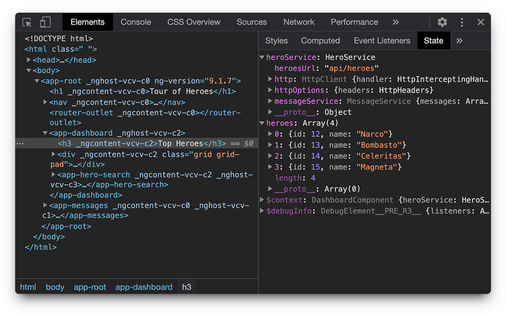

#   Angular State Inspector
An extension that lets you inspect the state of components.

Chrome: https://chrome.google.com/webstore/detail/angular-state-inspector/nelkodgfpddgpdbcjinaaalphkfffbem

Firefox: https://addons.mozilla.org/en-US/firefox/addon/angular_state_inspector/

Edge: https://microsoftedge.microsoft.com/addons/detail/angular-state-inspector/obfnbeenaokodmfahnfejnnalpeonijl?hl=en-US

